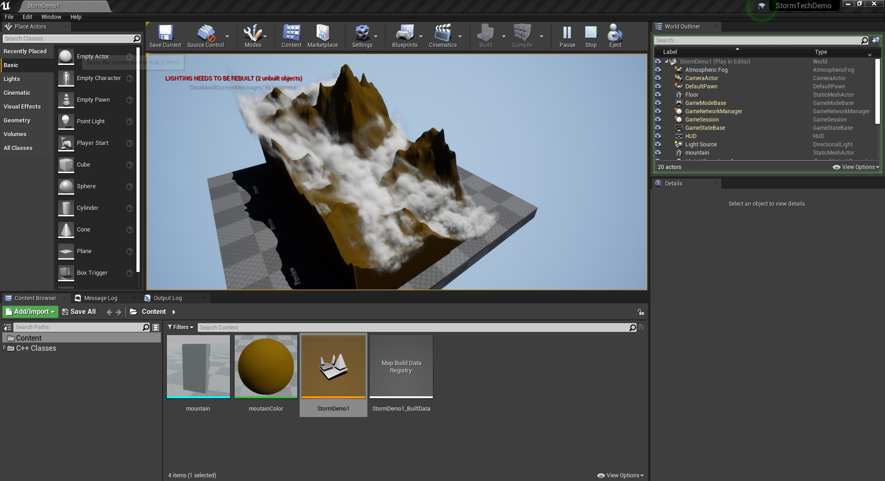
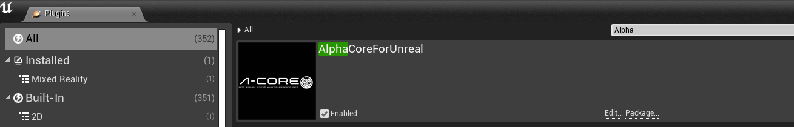
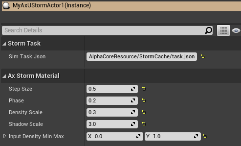

# **AlphaCore Storm Demo**

    

## 说明

1. 打开工程文件前，请先将AlphaCoreResource\StormCache\StormCache.rar压缩包解压到AlphaCoreResource\StormCache目录下。
2. 使用FusionProj仓库中AlphaCorePlugin分支的引擎启动该项目。
2. 请确认AlphaCoreForUnreal插件处于开启状态。
    

        
    

3. 工程文件中Storm Demo的内容在StormDemo1关卡下。
4. AxUStormActor中暴露了渲染相关参数，解算参数列表存储于AlphaCoreResource\StormCache\task.json中。
    

        
    

